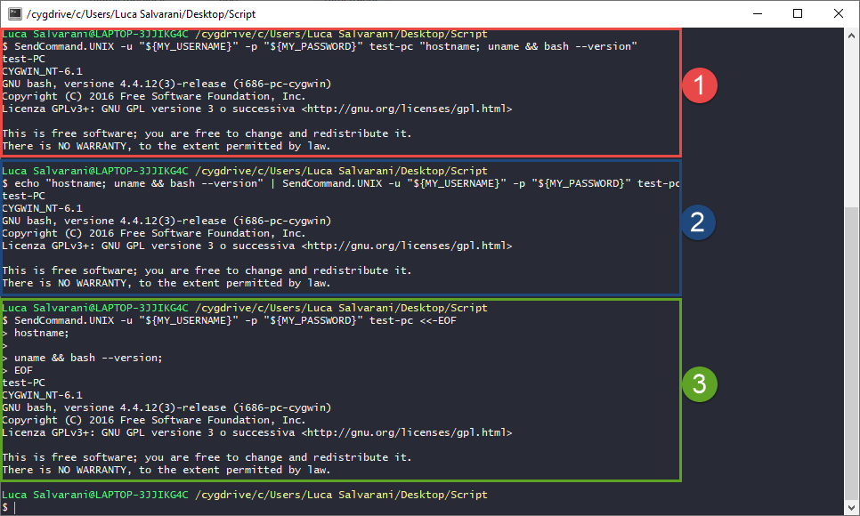

# SendCommandSSH
Utility to send command through SSH and receive output.

#### Syntax
```Bash
SendCommand.UNIX [-r] [-d] [-o] -u USERNAME -p PASSWORD TARGET_HOST COMMANDS
```
#### Examples
- Send `chage -l` command as `$MY_USERNAME`:
  ```bash
  SendCommand.UNIX -u $MY_USERNAME -p $MY_PASSWORD $MY_TARGET_HOST "chage -l $MY_USERNAME"
  ```

- Send `chage -l` command as `root`:
  ```bash
  # Short Option syntax
  SendCommand.UNIX -u $MY_USERNAME -p $MY_PASSWORD -r $MY_TARGET_HOST "chage -l $MY_USERNAME"
  
  # Full Option syntax
  SendCommand.UNIX --username $MY_USERNAME --password $MY_PASSWORD --asRoot $MY_TARGET_HOST "chage -l $MY_USERNAME"
  ```

- Send `chage -l` command as `root` and save the terminal output to log called `my_terminal.log`:
  ```bash
  SendCommand.UNIX -u $MY_USERNAME -p $MY_PASSWORD --asRoot -o my_terminal.log $MY_TARGET_HOST "chage -l $MY_USERNAME"
  ```
  
- Send a **long list** of commands as `root`:
  ```bash
  SendCommand.UNIX -u $MY_USERNAME -p $MY_PASSWORD --asRoot -o my_terminal.log $MY_TARGET_HOST <<-END_OF_SESSION
    echo "I am inside \$(hostname)";
    echo "My name is root";
    
    printf "\n";
	
    su - $OTHER_USER <<END_OF_SU
      printf "My name now is: "; whoami;

      printf "Timestamp is: "; date +%s:
    END_OF_SU
	
    printf "\n";
	
    printf "My name is still: "; whoami;
    
    # This is a very useful comment
    chage -l $MY_USERNAME
  END_OF_SESSION
  ```
  **NOTE**: you MUST use <kbd>TAB</kbd>s inside _here-document_ to make it work indented like this, not <kbd>SPACE</kbd>s. See [this question](https://unix.stackexchange.com/a/353689/348102) or [this article](https://linuxize.com/post/bash-heredoc/) for more info...

## Features
- **Passwordless** login (thanks to `sshpass`);
- Execute commands as **normal user** or **super user** (with `-r` or `--asRoot`);
- **Log to file** all the terminal output while still receiving filtered output (`-o` or `--output`);
- Works on both **Linux and AIX**.
- If `Bash` is available on the remote system, `stdout` and `stderr` routing is performed so that remote `stderr` is bound to the local `stderr`

## Why? 
I created this function because i needed to execute long sets of commands on remote shells and retrieve the result on different OS:
- On **Linux** (tested on RedHat) i could simply use `ssh` and `here-doc`.
- On **AIX** i couldn't become **root** unless i used `ssh -tt` (which in turn would cause all the terminal to be printed and i also had to explicitly send exit or it would hang forever).

I needed a portable solution, so that it would work regarless if the remote system was Linux or AIX and that let me login into the machine.

## How?
First of all a unique id is generated; this will be used to mark the lines containing the actual output of the commands injected into the session.

If no `COMMANDS` parameter is found or if this parameter is `-`, then the commands to execute will be read from the STDIN (like the `cat` command).

I used [sshpass](https://linux.die.net/man/1/sshpass) to connect to any remote ssh host without the need of typing each time the password, thus allowing to use this function into other scripts with hosts you don't have keys on. 

Once a connection is estabilished, the commands are sent and all of its output is **prefixed** with the unique id we created before. Meanwhile the output of the whole ssh process is piped into `decodeRemoteScreen` (a sort of `tee` on steroids) that executes a lot of the magic needed for the function to ACTUALLY be useful... In fact, every line:
- Is **sanitized** (no control characters like ANSI colors or carriage returns) and sent to the output file (only if this is provided);
- Is filtered and only the lines with the unique id are printed (without the id though). Only if `--debug` is **not specified**.
- Is sent **raw** (no filtering done). Only if `--debug` is **not specified**.

Initially the `decodeRemoteScreen` function was written in Bash, but i rewrote it in Perl because when saving a long output to a file it too much time. This seems to be a problem of Bash' read function which is [known to be very slow in loops](https://stackoverflow.com/a/13764233/8965861). After some research i found Perl was way faster. Well, that proved to be sooo true :). This is a test using another script of mine doing same operations with lots of output and `--output` set (so every line shown on the remote terminal will be saved on disk):
- **Bash**:
  ```
  real    1m2,453s
  user    0m13,274s
  sys     0m39,534s
  ```
- **Perl**:
  ```
  real    0m11,288s
  user    0m1,471s
  sys     0m3,797s
  ```

In this test Perl ended up being **6x times faster**!

## Usage

You can pass the commands in the following ways:
1. As **parameter**. Useful for few commands and/or simple operations
2. As **stdin** through the use of a **pipe** (same as before)
3. As **stdin** through the use of [**here-document**](https://linuxhint.com/bash-heredoc-tutorial/). This is ideal for more complex operations and/or long commands, since is more understandable and mantainable


